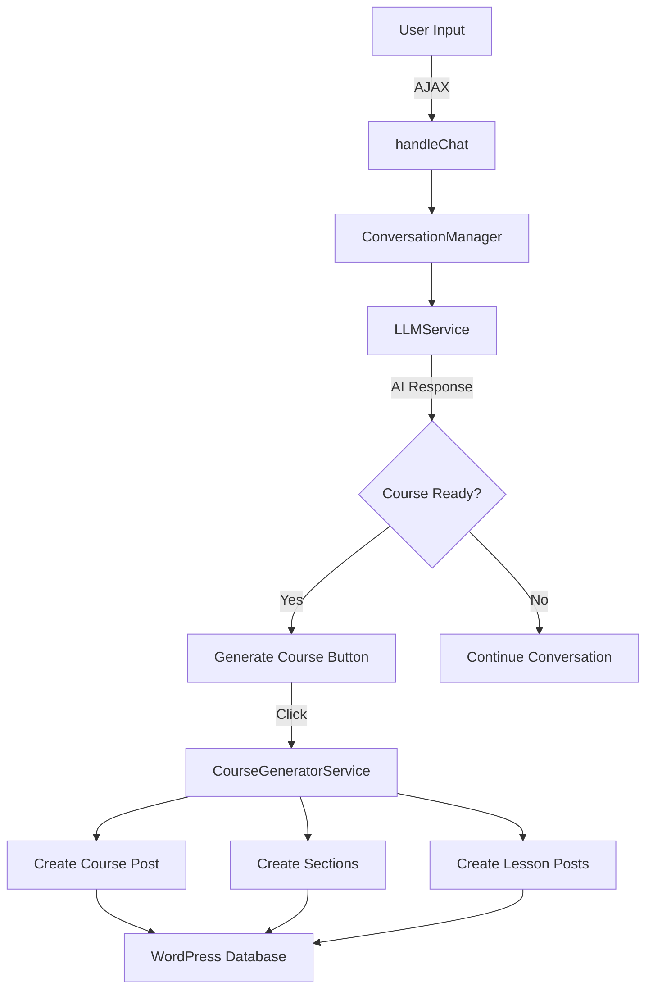
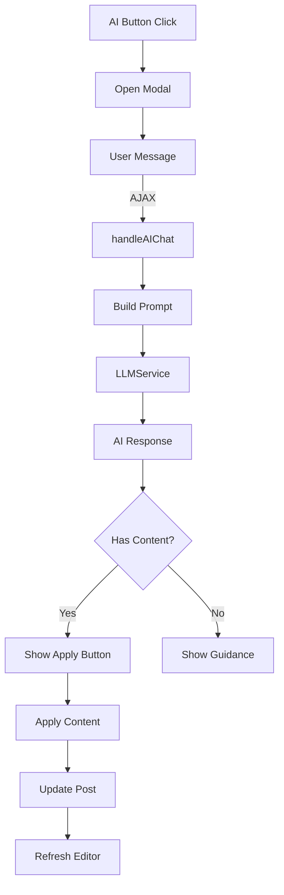

# Content Generation Flow Documentation

## Overview

This document maps the complete flow of AI-powered content generation in the MemberPress Courses Copilot plugin, covering courses, lessons, and quizzes.

## Table of Contents

1. [Architecture Overview](#architecture-overview)
2. [Course Generation Flow](#course-generation-flow)
3. [Lesson Generation Flow](#lesson-generation-flow)
4. [Quiz Generation Flow](#quiz-generation-flow)
5. [Editor AI Integration Flow](#editor-ai-integration-flow)
6. [Content Format Processing](#content-format-processing)
7. [Data Flow Diagrams](#data-flow-diagrams)

---

## Architecture Overview

### Key Services

1. **LLMService** (`src/MemberPressCoursesCopilot/Services/LLMService.php`)
   - Central AI communication service
   - Handles all AI model interactions via LiteLLM proxy
   - Manages prompt building and response processing

2. **CourseGeneratorService** (`src/MemberPressCoursesCopilot/Services/CourseGeneratorService.php`)
   - Creates courses, sections, and lessons in WordPress
   - Handles content formatting (Gutenberg blocks)
   - Manages post meta and relationships

3. **ConversationManager** (`src/MemberPressCoursesCopilot/Services/ConversationManager.php`)
   - Manages AI conversation sessions
   - Stores conversation history
   - Handles session persistence

4. **EditorAIIntegrationService** (`src/MemberPressCoursesCopilot/Services/EditorAIIntegrationService.php`)
   - Provides AI assistance in post editors
   - Handles real-time content generation
   - Manages editor UI integration

---

## Course Generation Flow

### Entry Points

1. **Admin UI** → `CourseCreatorPage.php`
2. **AJAX Handler** → `AjaxHandlers.php::handleChat()`

### Step-by-Step Flow

```
User Input → AJAX Request → ConversationManager → LLMService → CourseGeneratorService → WordPress Database
```

### Detailed Process

1. **User Initiates Course Creation**
   ```javascript
   // assets/js/ai-copilot.js
   $('#mpcc-chat-send').click() → sends message via AJAX
   ```

2. **AJAX Request Processing**
   ```php
   // AjaxHandlers.php
   handleChat() {
       → Verify nonce
       → Load/create session via ConversationManager
       → Process message through LLMService
       → Detect if course structure is ready
       → Return response or trigger generation
   }
   ```

3. **AI Conversation**
   ```php
   // LLMService.php
   generateCourseOutline($topic, $requirements) {
       → Build course outline prompt
       → Send to AI model (anthropic/claude-3-sonnet)
       → Parse structured response
       → Return course structure array
   }
   ```

4. **Course Structure Generation**
   ```php
   // CourseGeneratorService.php
   generateCourse($courseData) {
       → createCourse() - Creates mpcs-course post
       → For each section:
           → createSection() - Creates section in custom table
           → For each lesson:
               → createLesson() - Creates mpcs-lesson post
       → Return course ID and URLs
   }
   ```

5. **Content Format Processing**
   ```php
   // CourseGeneratorService.php
   convertToGutenbergBlocks($content) {
       → Check if already has Gutenberg blocks
       → Convert HTML to Gutenberg format
       → Fix malformed lists
       → Return formatted content
   }
   ```

### Data Structure Example

```php
$courseData = [
    'title' => 'Introduction to Web Development',
    'description' => '<!-- wp:paragraph -->...',
    'sections' => [
        [
            'title' => 'HTML Basics',
            'description' => 'Learn HTML fundamentals',
            'lessons' => [
                [
                    'title' => 'HTML Elements',
                    'content' => '<!-- wp:heading -->...',
                    'duration' => 15
                ]
            ]
        ]
    ]
];
```

---

## Lesson Generation Flow

### Entry Points

1. **Editor AI Button** → `EditorAIIntegrationService.php`
2. **Course Creator** → Via course generation flow

### Step-by-Step Flow

```
Editor Button Click → Modal Opens → User Input → AI Generation → Content Preview → Apply to Editor
```

### Detailed Process

1. **Editor Integration**
   ```php
   // EditorAIIntegrationService.php
   addAIButton() {
       → Adds AI button to post editor
       → Enqueues modal scripts
       → Passes context data
   }
   ```

2. **User Interaction**
   ```javascript
   // assets/js/editor-ai-modal.js
   $('#mpcc-editor-ai-send').click() {
       → Capture user message
       → Send AJAX request with context
       → Display AI response
       → Show apply/copy buttons
   }
   ```

3. **AI Content Generation**
   ```php
   // EditorAIIntegrationService.php
   handleAIChat() {
       → Build lesson prompt with context
       → Call LLMService
       → Detect content updates
       → Return formatted response
   }
   ```

4. **Content Application**
   ```javascript
   // editor-ai-modal.js
   $('.mpcc-apply-editor-content').click() {
       → Extract content from AI response
       → Preserve Gutenberg blocks
       → Update post via AJAX
       → Refresh editor content
   }
   ```

### Prompt Building

```php
buildLessonPrompt($message, $lessonData) {
    → Include lesson title and current content
    → Add parent course context
    → Specify Gutenberg block format
    → Request content within tags: [LESSON_CONTENT]...[/LESSON_CONTENT]
}
```

---

## Quiz Generation Flow

### Current Status

**Note: Quiz generation is planned but not yet implemented in the current version.**

### Planned Architecture

1. **QuizGeneratorService** (To be implemented)
   - Generate quiz questions from lesson content
   - Support multiple question types
   - Integrate with MemberPress Course Quizzes addon

2. **Question Types Support**
   - Multiple choice
   - True/false
   - Short answer
   - Essay questions

---

## Editor AI Integration Flow

### Block Editor vs Classic Editor

The plugin supports both editors with unified handling:

1. **Block Editor (Gutenberg)**
   ```javascript
   // Update via wp.data
   wp.data.dispatch('core/editor').editPost({content: editorContent});
   ```

2. **Classic Editor**
   ```javascript
   // Update via TinyMCE
   tinyMCE.get('content').setContent(editorContent);
   ```

### Content Tag System

Different post types use different content tags:
- Courses: `[COURSE_CONTENT]...[/COURSE_CONTENT]`
- Lessons: `[LESSON_CONTENT]...[/LESSON_CONTENT]`

---

## Content Format Processing

### Gutenberg Block Format

The system ensures all content is saved as Gutenberg blocks:

1. **AI Instructions**
   ```
   INSTRUCTION: Provide content in clean HTML format
   Use standard HTML tags: <h2>, <h3>, <p>, <ul>, <ol>, <li>, <strong>, <em>
   ```

2. **List Format Fixing**
   ```php
   fixMalformedGutenbergLists($content) {
       → Detect multiple <ul> or <ol> tags
       → Extract all <li> items
       → Rebuild with single list structure
   }
   ```

3. **Format Conversion**
   ```php
   convertToGutenbergBlocks($content) {
       → Check if already has blocks
       → Convert HTML elements to blocks
       → Apply list fixes
       → Return formatted content
   }
   ```

### Content Flow Example

```
User Input: "Create a lesson about CSS basics"
    ↓
AI Response: Clean HTML content in [LESSON_CONTENT] tags
    ↓
Display: HTML renders nicely in the chat interface
    ↓
Apply: Convert HTML to Gutenberg blocks when saving
    ↓
Result: Properly formatted Gutenberg blocks in editor
```

---

## Data Flow Diagrams

### Course Creation Flow



### Editor AI Flow



---

## Key Files Reference

### PHP Files
- `src/MemberPressCoursesCopilot/Services/LLMService.php` - AI communication
- `src/MemberPressCoursesCopilot/Services/CourseGeneratorService.php` - Course/lesson creation
- `src/MemberPressCoursesCopilot/Services/ConversationManager.php` - Session management
- `src/MemberPressCoursesCopilot/Services/EditorAIIntegrationService.php` - Editor integration
- `src/MemberPressCoursesCopilot/Controllers/AjaxHandlers.php` - AJAX endpoints

### JavaScript Files
- `assets/js/ai-copilot.js` - Main chat interface
- `assets/js/editor-ai-modal.js` - Editor modal functionality
- `assets/js/editor-ai-button.js` - Editor button integration

### Admin Pages
- `src/MemberPressCoursesCopilot/Admin/CourseCreatorPage.php` - Course creator UI
- `src/MemberPressCoursesCopilot/Admin/CourseEditorPage.php` - Course editor enhancements

---

## Content Display and Editing

### Course Editor Preview
1. **Lesson Content Preview** - Shows first 200 characters of lesson content in course structure
2. **Readable Format** - Gutenberg blocks are converted to readable text for preview
3. **Preserved Formatting** - Lists, headings, and paragraphs display correctly

### Lesson Editor
1. **Gutenberg to Readable** - Content is converted from Gutenberg blocks to readable text for editing
2. **Original Preservation** - Original Gutenberg blocks are stored and used when saving
3. **Autosave Support** - Preserves Gutenberg blocks during autosave operations

### Content Flow in Editor
```
Lesson Draft (Gutenberg blocks)
    ↓
Load in Editor → Convert to readable text (gutenbergToReadable)
    ↓
User Edits (plain text in textarea)
    ↓
Save → Use original Gutenberg blocks (preserved in data attribute)
    ↓
Course Creation → Gutenberg blocks saved to WordPress
```

## Content Generation Best Practices

1. **AI Generates Gutenberg Blocks** - AI generates content directly in Gutenberg block format
2. **No Conversion Needed** - Content is saved as-is since it's already in the correct format
3. **Fix Lists Aggressively** - Multiple `<ul>` tags should be consolidated
4. **Use Content Tags** - Wrap generated content in appropriate tags for extraction
5. **Handle Both Editors** - Support Block Editor and Classic Editor
6. **Provide Context** - Include parent course info when generating lessons
7. **Log Everything** - Use logger for debugging content issues
8. **Avoid wp_kses_post()** - This function strips Gutenberg block comments
9. **Display vs Edit** - Show readable text for editing, preserve Gutenberg blocks for saving

---

## Future Enhancements

1. **Quiz Generation** - Automatic quiz creation from lesson content
2. **Bulk Generation** - Generate multiple lessons simultaneously
3. **Template System** - Pre-defined course templates
4. **Content Refinement** - Iterative improvement of generated content
5. **Media Integration** - AI-suggested images and videos
6. **Learning Path Creation** - Multi-course curriculum generation
7. **WYSIWYG Editor** - Replace textarea with rich text editor that preserves Gutenberg blocks

---

*Last updated: 2025-09-06*
*Version: 1.1.0*